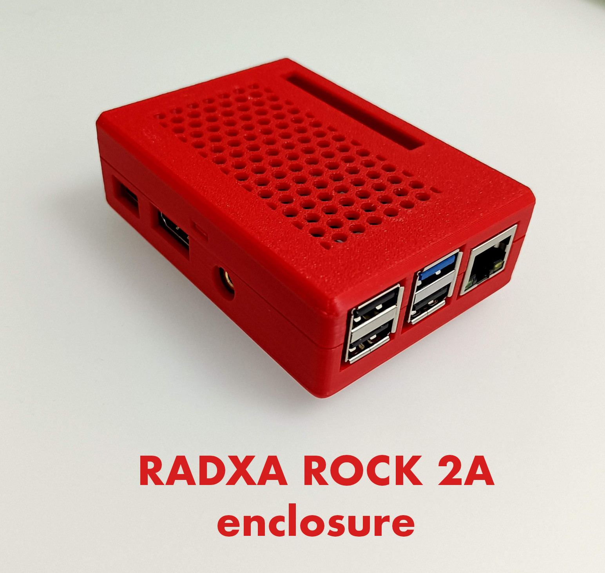

# Enclosure for the "Radxa Rock 2A" Single Board Computer

The [OpenSCAD](https://openscad.org/) source uses the fantastic
library
[YAPP_Box Yet Another Parametric Projectbox generator](https://github.com/mrWheel/YAPP_Box)
to generate the enclosure for the SBC
[Radxa Rock 2A](https://radxa.com/products/rock2/2a/), wich has a form
factor similar to the more popular Raspberry Pi.

The main features of this enclosure are:

- Tightly assembled with all the connectors easily accessible.

- No screws needed, thanks to *snap joints* base and lid "click"
  together without the need for screws or other aids.

- The circuit board is neatly clamped between the base standoffs and
  the lid push-downs.

- Optionally, you easily add round self-adhesive feets of 10mm or less.

- Two variants available: with or without a cutout on the lid to access
  the GPIO pins.

In the [3dmodel](3dmodel/) folder you will find:

- The 3D STL model for both variants.

- The `.3mf` files that are created by `Bambu Lab Studio` and that
  contains the 3D model plus the `print profile` with printing
  parameters I used on my `Bambu Lab A1` printer.

In the [img](img/) folder you will find more enclosure images.

  
